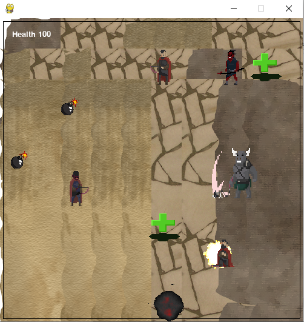
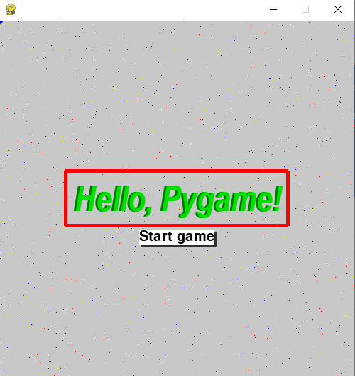
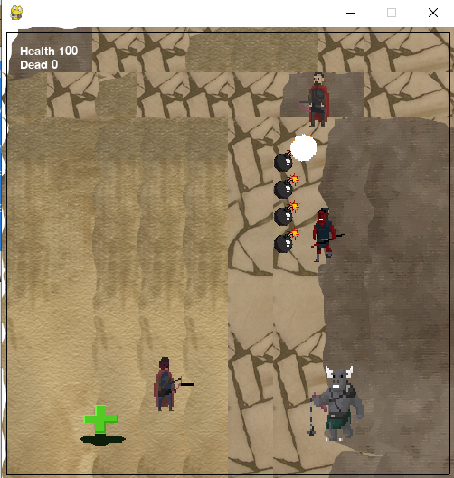
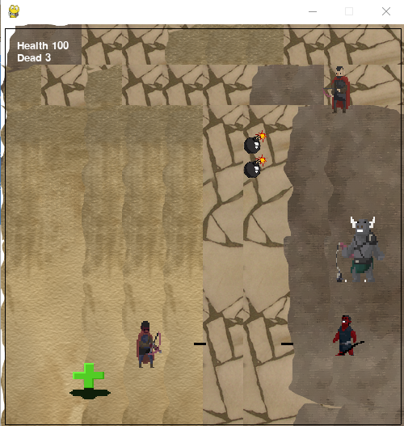
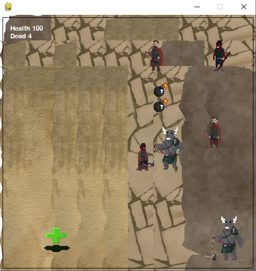
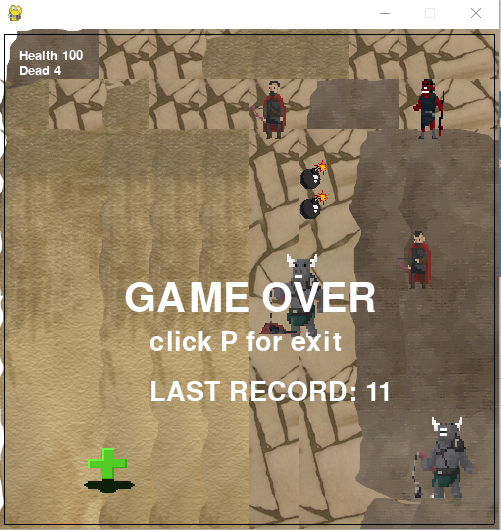

# *Экшен-игра*




Разработана экшен-игра. Для запуска игры необходимо запустить скрипт ```main.py```.

Необходимо управлять лучником и производить выстрелы по противникам и строить им ловушки с использованием бомб. 

При столкновении с противником или его стрелой лучник погибает. Когда противник доходит до левой границы, у лучника
уровень здоровья падает, поэтому необходимо продержаться как можно дольше и не пропустить противников.

В игре есть возможность учитывать **рекорды**.


# Реализация *Action*-игры с *Pygame*

  Приложение написано на языке программирования **python** с использованием фреймворков **Pygame**.
  Последовательность работы с программой следующая:
  - запустить файл ```main.py```. Появиться заствка игры.
  - Нажать на ```start game```.
  - Использовать соответствующие клавиши для управления персонажем (лучником)


В папке ```project``` проекта есть каталог:

| Каталог | Предназначение |
| ------ | ------ |
| ```project\data``` | для хранения карт, аудио, спрайтов, тайлов, файла рекордов|
| ```project\*.py``` | для хранения исходного кода|


# Предупреждения и ссылки на источники
> Спрайты и тайлы для игры были загружены с сайта
[**https://opengameart.org**](https://opengameart.org).


### Установка и запуск

Для запуска приложения с исползованием интерпретатора python рекомендуется 
использовать использовать ```python 3.6.8``` (*python 3.6*).
Предварительно необходимо установить все внешние библиотеки.

```$ pip install -r requirements.txt```

### Правила игры
После нажатия на ```start game``` переходи к основному циклу игры, где Вам необходимо
расставить бомбочки на карте (лучше это сделать сразу же), перемещаться (используя ```клавиши-стрелки```) и стрелять 
из лука по врагам (клаиша ```Space```), которые наступают каждые
 25 секунд. Будьте острожны: при попадании стрелы в бомбочку, происходит взрыв.
 Когда враги сталкиваются с бомбочками, они подрываются. Однако при столкновении с противником или его стрелой, 
 погибаете Вы! При достижении врагами левой вертикальной границы, у Вас отнимаются жизни.
 
 Бомбочки будут появляться каждые 2.5 минут, а так называемая "аптечка" каждые 5.
 
 Остановить стрельбу можно нажатием на любую из клавиш перемещения. Стрелять 2 раза по
 раненому врагу нельзя.
 
 Вам нужно продержаться как можно дольше, поразив как можно больше противников.
 В конце игры есть возможность увидеть прошлый рекорд или, если Вы его "побили",
 получить сообщение, что у Вас лучший результат, который программа автоматически сохранит.
 
 Ниже представлены скриншоты.
 
 
 
 
 
 
 
 